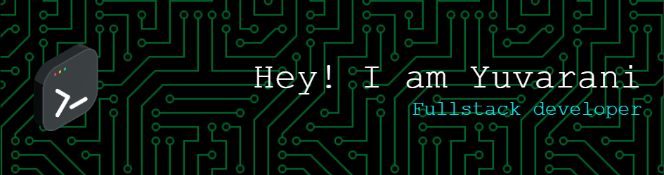

## Welcome to my GitHub! 👩‍💻✨

**🚀 About Me**
🔭 Current Work: Software Developer specializing in chatbot technologies at a private Malaysian-based company. I’m exploring ways to make chatbots smarter, more efficient, and engaging!

🌱 Learning Path: I'm pursuing my Master's degree in Software Engineering to dive deeper into this fascinating field. Every day is a chance to learn something new!

👯 Collaboration: I love collaborating with like-minded developers. Whether you're working on a cool project or need help troubleshooting code, let's work together!

🤔 Looking for help with: NLP, Advanced algorithms, optimizing code, and any creative solution to solve complex problems.

💬 Feel free to ask me about: Chatbot development, software engineering, programming tips, or just some coding challenges for fun!

📫 Contact me: You can reach out to me via email at 24073175@siswa.um.edu.my.

😄 Pronouns: She/Her

⚡ Fun Fact: I love coding because it's like solving a puzzle every day, and I can't get enough of the challenge!

🌟 What’s in this repository?
Here, you'll find projects related to my Masters Degree projects and everything in between. I'm constantly working on enhancing my code and sharing new ideas. Feel free to explore and contribute to the projects that catch your interest!

🤖 Some Projects You Might Find Interesting:
Yet to come soon. You may find them at https://github.com/Yuvarani24073175/Yuvarani24073175

🛠️ Technologies I Love
Programming Languages: JavaScript, Java
Frameworks & Libraries: Express JS, Angular
Databases: MySQL, MongoDB
Tools: Docker, Git, VSCode, Postman

🌱 Currently Working On
Exploring Chatbot AI: Improving chatbots that can handle more complex conversations.
Optimizing Code: Working on making applications run more efficiently by refining algorithms.
